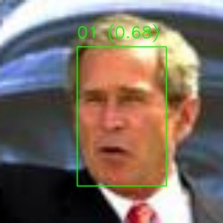

# 顔認証
---

OpenCVが提供するニューラルネットワークを使った顔認証プログラムです。

# 概要
---
**画像から顔を探す**

　opencvの[学習済みモデル（ YuNet ）](https://github.com/opencv/opencv_zoo/blob/master/models/face_detection_yunet/face_detection_yunet_2022mar.onnx)を使って、入力画像に写っている全ての顔を検知します。


　　　　　　img.jpg


```
python3 detect.py img.jpg
```
```
# 出力結果
OK Normal end (find 1 face)
```
**特徴量を抽出**

　opencvの[学習済みモデル（ SFace ）](https://github.com/opencv/opencv_zoo/blob/master/models/face_recognition_sface/face_recognition_sface_2021dec.onnx)を用いた主成分分析 Principal component analysis: PCA で検知した顔の特徴量をバイナリデータ（ .npy ）で記録します。PCAは、機械学習の領域において、教師なし学習の手法に分類されます。抽出した特徴量データは、顔認証時の比較に用いられます。
```
python3 feature.py 01.jpg
```
```
# 出力結果
[[-1.638414   -0.02444979  0.9627669   0.61841345 -0.713856    3.903615
  -0.89956     0.5823029  -1.4559474  -0.8737672  -2.7391284   1.0349765
  -0.997739    0.01708565 -0.6114139  -1.2063152  -2.311872    0.24290511
  -0.66934144  1.3697484  -1.0968163   0.2865632   2.1215842   0.14641935
  -0.6166305  -2.8872366  -0.18022658 -0.2796506   1.4826432  -1.2881849
   0.41560024 -1.3580176   0.18166958 -2.6744993   1.0205497   0.27069393
   1.485494   -1.1154959   0.32505888  0.16185752  0.17788099 -0.6677594
   2.7455559   0.67430884 -0.08066396 -0.84552187  0.30376074 -0.39455444
  -2.219663   -0.26838577 -0.8457494  -0.12780634 -0.55635077  1.4837204
  -0.6772504  -0.01003938 -0.8874581  -2.2505558   0.51910484  0.8224853
   0.41550225  1.7770157  -0.93066543  0.3315067   0.16619784  0.26309463
   0.17615122 -1.1452706  -0.68008864  0.06630942  1.7928758   2.6744144
  -1.58627     0.13345474  1.6257097   0.76517344 -0.06701853  0.7541492
  -0.76801145  1.5600859   1.2142595  -0.4452445  -0.71414196  1.6784474
  -1.8967717  -0.9532396   2.5706022  -1.728511   -1.4083534  -0.13867569
  -0.657005    0.54380125  2.9430828  -1.6815094  -0.23638844 -2.0565414
   0.5587643   0.7294251  -1.2893864  -0.38611168  1.3661084   1.0485553
   0.8675697  -0.5952506   0.8263226  -1.6592205  -1.0287952  -0.26504195
  -0.31674823  0.97146106  2.243947   -1.4258233  -1.658063    0.18401828
   2.3309004  -0.641211    0.69257927  1.677737   -0.67804885  1.9094931
   1.7118697  -1.0433948   2.4851487  -1.4300998   1.247159    0.22949931
  -0.3217669   1.3616025 ]]
<class 'numpy.ndarray'>
OK normal end
```

**特徴量を比較・認証**

　入力画像に対して、先述した検知及び抽出を行い、入力画像内の顔と事前に持っているIDの特徴量データとコサイン類似度で比較し、認証します。認証の閾値はOpenCV Tutorialsのデフォルト値0.363を採用しています。
```
python3 recognize.jpg id.jpg
```
```
[('01', array([[-1.638414  , -0.02444979,  0.9627669 ,  0.61841345, -0.713856  ,
         3.903615  , -0.89956   ,  0.5823029 , -1.4559474 , -0.8737672 ,
        -2.7391284 ,  1.0349765 , -0.997739  ,  0.01708565, -0.6114139 ,
        -1.2063152 , -2.311872  ,  0.24290511, -0.66934144,  1.3697484 ,
        -1.0968163 ,  0.2865632 ,  2.1215842 ,  0.14641935, -0.6166305 ,
        -2.8872366 , -0.18022658, -0.2796506 ,  1.4826432 , -1.2881849 ,
         0.41560024, -1.3580176 ,  0.18166958, -2.6744993 ,  1.0205497 ,
         0.27069393,  1.485494  , -1.1154959 ,  0.32505888,  0.16185752,
         0.17788099, -0.6677594 ,  2.7455559 ,  0.67430884, -0.08066396,
        -0.84552187,  0.30376074, -0.39455444, -2.219663  , -0.26838577,
        -0.8457494 , -0.12780634, -0.55635077,  1.4837204 , -0.6772504 ,
        -0.01003938, -0.8874581 , -2.2505558 ,  0.51910484,  0.8224853 ,
         0.41550225,  1.7770157 , -0.93066543,  0.3315067 ,  0.16619784,
         0.26309463,  0.17615122, -1.1452706 , -0.68008864,  0.06630942,
         1.7928758 ,  2.6744144 , -1.58627   ,  0.13345474,  1.6257097 ,
         0.76517344, -0.06701853,  0.7541492 , -0.76801145,  1.5600859 ,
         1.2142595 , -0.4452445 , -0.71414196,  1.6784474 , -1.8967717 ,
        -0.9532396 ,  2.5706022 , -1.728511  , -1.4083534 , -0.13867569,
        -0.657005  ,  0.54380125,  2.9430828 , -1.6815094 , -0.23638844,
        -2.0565414 ,  0.5587643 ,  0.7294251 , -1.2893864 , -0.38611168,
         1.3661084 ,  1.0485553 ,  0.8675697 , -0.5952506 ,  0.8263226 ,
        -1.6592205 , -1.0287952 , -0.26504195, -0.31674823,  0.97146106,
         2.243947  , -1.4258233 , -1.658063  ,  0.18401828,  2.3309004 ,
        -0.641211  ,  0.69257927,  1.677737  , -0.67804885,  1.9094931 ,
         1.7118697 , -1.0433948 ,  2.4851487 , -1.4300998 ,  1.247159  ,
         0.22949931, -0.3217669 ,  1.3616025 ]], dtype=float32))]
True ('01', 0.6752756895766652)
OK Normal end
```


　　　　　　out.jpg

# 参考文献
---
- https://qiita.com/UnaNancyOwen/items/8c65a976b0da2a558f06
 
